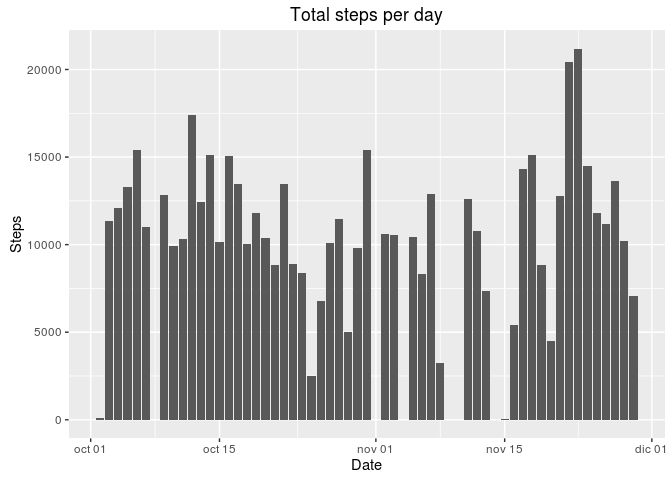
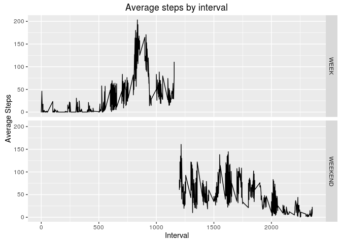

# Activity Monitoring Analysis
RPATAL  
April 10, 2016  

#Include required libraries.

```r
library(dplyr)
```

```
## 
## Attaching package: 'dplyr'
## 
## The following objects are masked from 'package:stats':
## 
##     filter, lag
## 
## The following objects are masked from 'package:base':
## 
##     intersect, setdiff, setequal, union
```

```r
library(ggplot2)
library(mice)
```

```
## Loading required package: Rcpp
## mice 2.25 2015-11-09
```

```r
library(timeDate)
```


## Loading and preprocessing the data

```r
#Read data and get dataset without missing data.
activity_raw <- read.csv("/home/unknown/r_workspace/activity.csv")
activity <- na.omit(activity_raw)
```

## What is mean total number of steps taken per day?

```r
#Calculating total steps per day, mean and median
activity_summary <- activity %>% group_by(date) %>% summarize(total_steps=sum(steps), mean_steps=mean(steps), median_steps=median(steps))
activity_summary <- transform(activity_summary, date=strptime(date, format = "%Y-%m-%d"))
print(activity_summary)
```

```
##          date total_steps mean_steps median_steps
## 1  2012-10-02         126  0.4375000            0
## 2  2012-10-03       11352 39.4166667            0
## 3  2012-10-04       12116 42.0694444            0
## 4  2012-10-05       13294 46.1597222            0
## 5  2012-10-06       15420 53.5416667            0
## 6  2012-10-07       11015 38.2465278            0
## 7  2012-10-09       12811 44.4826389            0
## 8  2012-10-10        9900 34.3750000            0
## 9  2012-10-11       10304 35.7777778            0
## 10 2012-10-12       17382 60.3541667            0
## 11 2012-10-13       12426 43.1458333            0
## 12 2012-10-14       15098 52.4236111            0
## 13 2012-10-15       10139 35.2048611            0
## 14 2012-10-16       15084 52.3750000            0
## 15 2012-10-17       13452 46.7083333            0
## 16 2012-10-18       10056 34.9166667            0
## 17 2012-10-19       11829 41.0729167            0
## 18 2012-10-20       10395 36.0937500            0
## 19 2012-10-21        8821 30.6284722            0
## 20 2012-10-22       13460 46.7361111            0
## 21 2012-10-23        8918 30.9652778            0
## 22 2012-10-24        8355 29.0104167            0
## 23 2012-10-25        2492  8.6527778            0
## 24 2012-10-26        6778 23.5347222            0
## 25 2012-10-27       10119 35.1354167            0
## 26 2012-10-28       11458 39.7847222            0
## 27 2012-10-29        5018 17.4236111            0
## 28 2012-10-30        9819 34.0937500            0
## 29 2012-10-31       15414 53.5208333            0
## 30 2012-11-02       10600 36.8055556            0
## 31 2012-11-03       10571 36.7048611            0
## 32 2012-11-05       10439 36.2465278            0
## 33 2012-11-06        8334 28.9375000            0
## 34 2012-11-07       12883 44.7326389            0
## 35 2012-11-08        3219 11.1770833            0
## 36 2012-11-11       12608 43.7777778            0
## 37 2012-11-12       10765 37.3784722            0
## 38 2012-11-13        7336 25.4722222            0
## 39 2012-11-15          41  0.1423611            0
## 40 2012-11-16        5441 18.8923611            0
## 41 2012-11-17       14339 49.7881944            0
## 42 2012-11-18       15110 52.4652778            0
## 43 2012-11-19        8841 30.6979167            0
## 44 2012-11-20        4472 15.5277778            0
## 45 2012-11-21       12787 44.3993056            0
## 46 2012-11-22       20427 70.9270833            0
## 47 2012-11-23       21194 73.5902778            0
## 48 2012-11-24       14478 50.2708333            0
## 49 2012-11-25       11834 41.0902778            0
## 50 2012-11-26       11162 38.7569444            0
## 51 2012-11-27       13646 47.3819444            0
## 52 2012-11-28       10183 35.3576389            0
## 53 2012-11-29        7047 24.4687500            0
```

```r
#Plot total steps. Since we already have calculated the total we can use a bar plot.
ggplot(data=activity_summary, aes(activity_summary$date, activity_summary$total_steps)) + geom_bar(stat="identity") + ggtitle("Total steps per day") + ylab("Steps") + xlab("Date")
```

 

## What is the average daily activity pattern?

```r
#Create time series
interval_average <- activity %>% group_by(interval) %>% summarize(average_steps=mean(steps))
ggplot(interval_average, aes(interval_average$interval, interval_average$average_steps)) + geom_line() + xlab("Interval") + ylab("Average Steps") + ggtitle("Average steps by interval")
```

 

```r
#Get the interval with the higher steps average
max_average_row <- which.max(interval_average$average_steps)
max_average_interval <- interval_average[[max_average_row,1]]
print(paste("The interval with the higher steps average is ", max_average_interval))
```

```
## [1] "The interval with the higher steps average is  835"
```

## Imputing missing values

```r
#Calculate the number of missing values.
md.pattern(activity_raw)
```

```
##       date interval steps     
## 15264    1        1     1    0
##  2304    1        1     0    1
##          0        0  2304 2304
```

```r
imputedValues <- mice(activity_raw, method = "pmm", seed = 500)
```

```
## 
##  iter imp variable
##   1   1  steps
##   1   2  steps
##   1   3  steps
##   1   4  steps
##   1   5  steps
##   2   1  steps
##   2   2  steps
##   2   3  steps
##   2   4  steps
##   2   5  steps
##   3   1  steps
##   3   2  steps
##   3   3  steps
##   3   4  steps
##   3   5  steps
##   4   1  steps
##   4   2  steps
##   4   3  steps
##   4   4  steps
##   4   5  steps
##   5   1  steps
##   5   2  steps
##   5   3  steps
##   5   4  steps
##   5   5  steps
```

```r
activity_imputed <- complete(imputedValues, 1)

#Calculating total steps per day, mean and median for activity with imputed data
activity_imputed_summary <- activity_imputed %>% group_by(date) %>% summarize(total_steps=sum(steps), mean_steps=mean(steps), median_steps=median(steps))

#Transform data
activity_imputed_summary <- transform(activity_imputed_summary, date=strptime(date, format = "%Y-%m-%d"))

#Create graphic
ggplot(data=activity_imputed_summary, aes(activity_imputed_summary$date, activity_imputed_summary$total_steps)) + geom_bar(stat="identity") + ggtitle("Total steps per day (Imputed data)") + ylab("Steps") + xlab("Date")
```

 

## Are there differences in activity patterns between weekdays and weekends?

```r
#Transform data to create time series
activity_imputed_date <- transform(activity_imputed, date=as.POSIXct(strptime(date, format = "%Y-%m-%d")))
activity_imputed_clasif <- mutate(activity_imputed_date, type=ifelse(isWeekday(activity_imputed_date$date, wday=1:5), "WEEK", "WEEKEND"))
interval_average_clas <- activity_imputed_clasif %>% group_by(interval, type) %>% summarize(average_steps=mean(steps))
ggplot(interval_average_clas, aes(interval_average_clas$interval, interval_average_clas$average_steps)) + geom_line() + xlab("Interval") + ylab("Average Steps") + ggtitle("Average steps by interval") + facet_grid(type ~ .)
```

 
